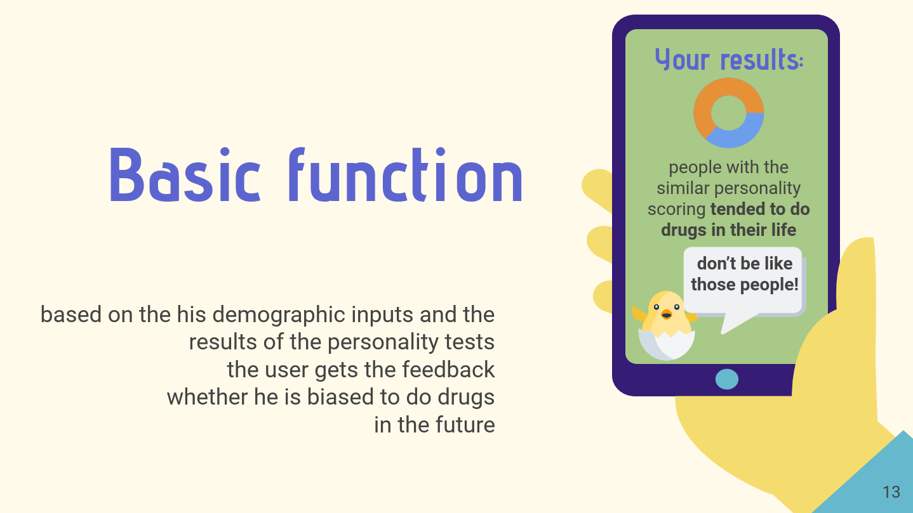

# Data Science Project in Week 6 of the Data Science Bootcamp [@neuefische](https://www.neuefische.de/)

This is a collaborative project, authored together with [@BinaerBaer](https://github.com/BinaerBaer/)

## Summary:

Evaluating the risk whether a person tends to consume drugs is not only important for each individual person, 
but for our entiry society as medical treatment and resozialization of an adicted person is costly. 
That is each individual of our society has a responsibility to prevent him-/herself to get in touch with drugs. 
To facilitate that an app was developed to help to self-assess a tendency to become a drug consumer. 
To do this we used data from a survey, which asked people questions about their demographic background and personality. 
The dataset is described [here](https://archive.ics.uci.edu/ml/datasets/Drug+consumption+%28quantified%29#).

## Structure of the repository:

In this repository you find the whole process of our approach within our [notebook](DS-Project-Personality-vs-Risk-of-Drug-Use.ipynb).

In addition we created a business [presentation](DS-Project-Presentation-Personality-vs-Drug-Use.pdf) for our fictitious recommendation app. Don't take this presentation too seriously :wink:.

## Business Case:

We analysed the given dataset with a fictitious business case in mind.
We want to develop an app that by testing the users personality makes recommendations 
whether the user might tend to do drugs in the future. The goal is to prevent drug use and sensitize the user.
The result of the app is shown in an encouraging way, it might look like to following:

## Key Takeaways:
* Logistic Regression gives the best results for our business case
* All classifiers deliver very similar values for the precision
* Using all feature not always gives the best model. (That is for our business case there is no need to survey caffeine, chocolate, alcohol)

## Future Work:
* Definition of targets:
    * Other target groups or more might be considered, maybe there is one specific drug which is highly interested
* Definition of metric:
    * As discussed in the last section recall is also a possible metric for this business case. An optimization on recall might change the results. 
    * Unsettle (recall) vs. don't unsettle (precision) people
* Our survey data is from people who are already taking drugs. For pur prediction we use personality characteristics, which might change when taking drugs. We however assume that this is not the case. Otherwise we could not use this data to make predictions on potential drug users. This might be clarified talking to an expert.
* In our business case a possibility to overcome this and also to test the predictions might be an optional check whether a tested person turned into a drug user or not after a certain time. 
* Our model is biased for ethnicity “white”. If possible observations fromdifferent ethnicities should be included.
