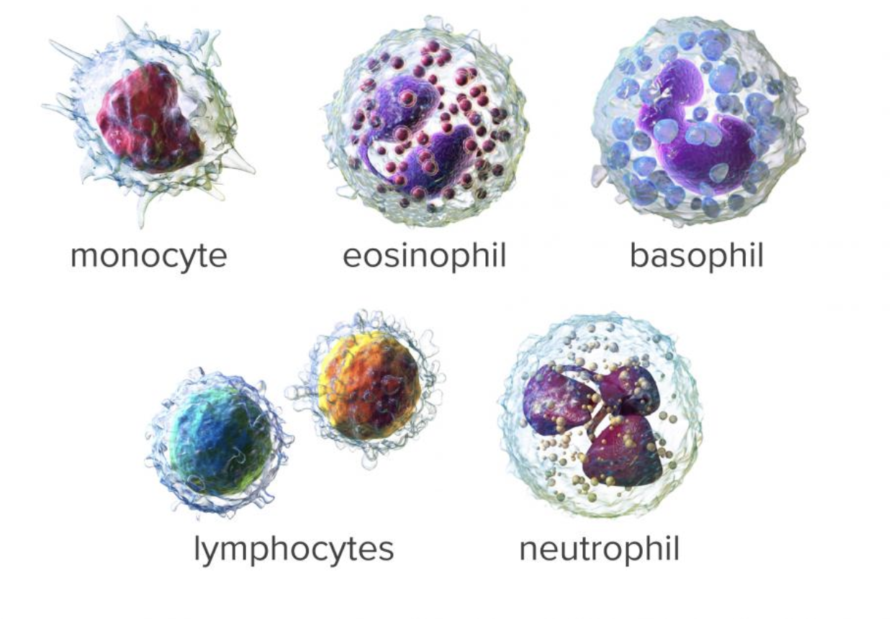
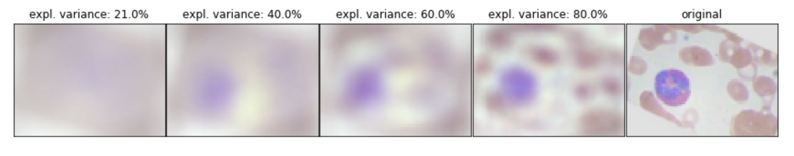
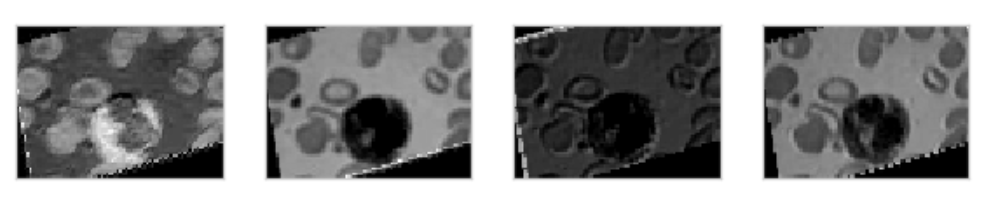
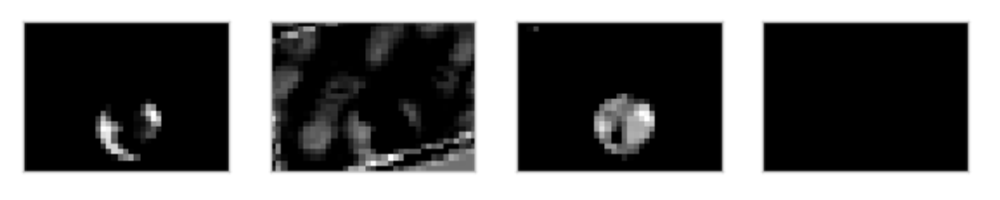
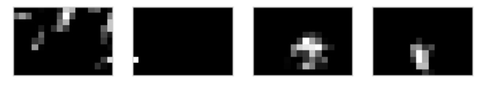
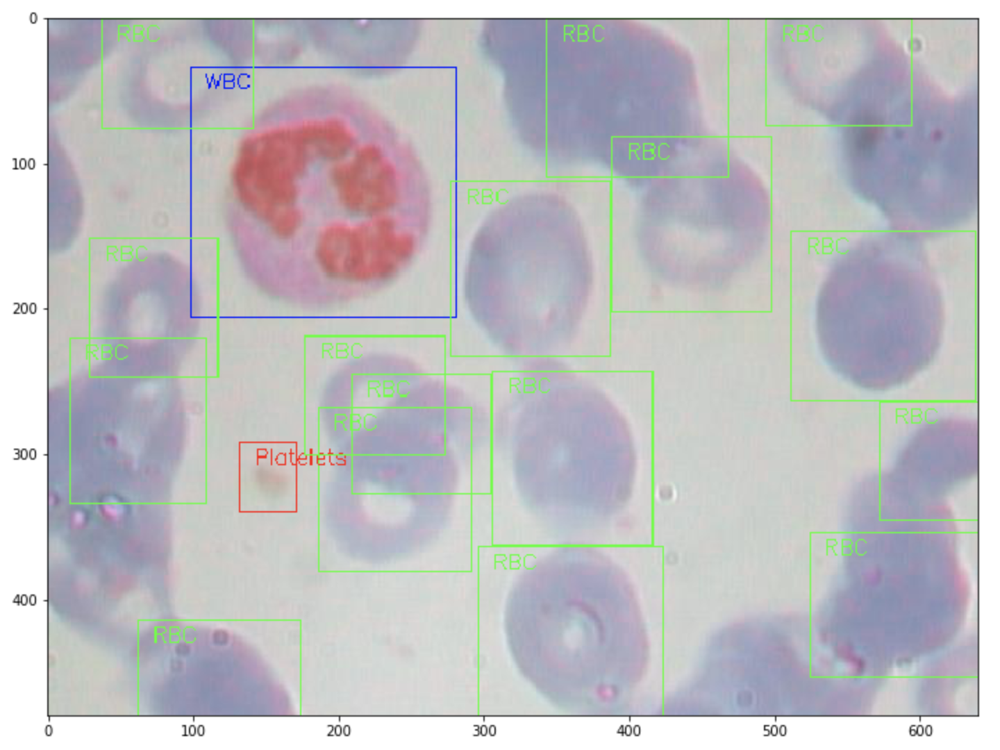

# Final Data Science Project of the Data Science Bootcamp [@neuefische](https://www.neuefische.de/)

Analysing blood cell images from https://www.kaggle.com/paultimothymooney/blood-cells

Image by Blausen Medical - BruceBlaus. When using this image in external sources it can be cited as:Blausen.com staff (2014). "Medical gallery of Blausen Medical 2014". WikiJournal of Medicine 1 (2). DOI:10.15347/wjm/2014.010. ISSN 2002-4436., CC BY-SA 4.0, https://commons.wikimedia.org/w/index.php?curid=56845134

**Summary**

White blood cells (WBCs), also called leucocytes, are the cells of the immune system that are involved in protecting the body against both infectious disease and foreign invaders. Each of the types has its own purpose. In this project microscope images of white blood cells are classified by their category. The objective is to use different types of techniques in order to tackle this problem. In a first step the problem is regarded as a binary classification problem. White blood cells can be categorized in two different ways, either by structure (granulocytes or agranulocytes) or by cell lineage (myeloid cells or lymphoid cells). These two problems are considered in Notebooks 02 and 03. Both problems are technically similar, however the second one gives better predicting accuracy (about 77%). In a second step all four different types are classified using a self-bulid CNN (more than 80% accuracy) and using transfer learning.

**Content**

* 00_setup.txt: Needed packages and versions to run the code
* Notebook 01: EDA and Data Preprocessing
* Notebook 02: Binary classification (granulocytes vs. agranulocytes) using a PCA for dimension reduction and classical machine learning algorithms
* Notebook 03: Binary classification (lymphocytes vs. rest) using a PCA for dimension reduction and classical machine learning algorithms
* Notebook 04: Multiple classification (eosinophil, neutrophil, lymphocyte & monocye) using a CNN
* Notebook 05: Multiple classification (eosinophil, neutrophil, lymphocyte & monocye) using transer learning build on VGG16
* Notebook 06: Short Outlook on Object Detection
* Folder Plots: Some plotting results
* Folder Images: Some Images used in the notebooks and presentation 
* capstone_presentation_frauke_albrecht.pdf: Presentation of the project

**Key Takeaways**
* The classical Machine Learning approach has a problem with overfitting in cross-validation due to the data structure (detailed explanations in notebook 02 and 03)
* The best models (SVC, KNN, RandomForestClassifier, XGBoost) are stacked together and achieve accuracy of 57% (AUC score 0.62) and 77% (AUC score 0.75), respectively for the two binary classification problems
* The CNN approach is much more promissing for this task. The simple model presented in Notebook 04 achieves a maximum accuracy of 85% and a mean of over 80% for the last 10 training epochs.

**Future Work**
* Improve accuracy in the CNN approach by hyperparameter tuning
* Include object detection in order to detect the location of white blood cells, red blood cells and platelets

